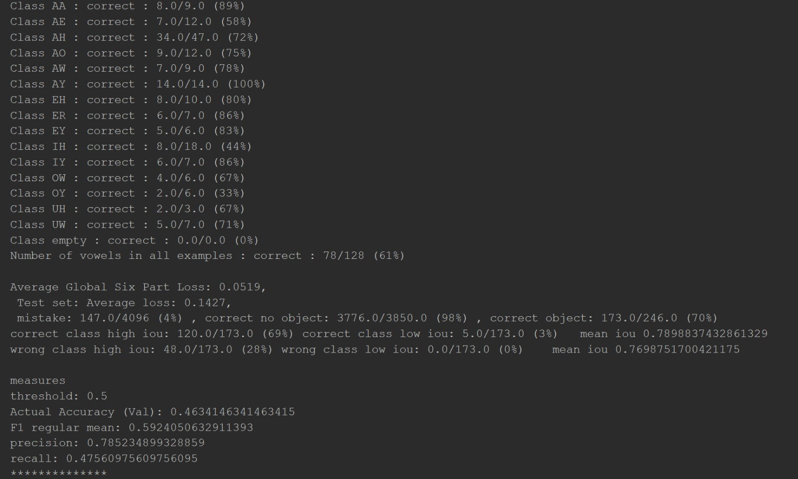

# Speech Yolo Vowels Neural Net

This is part of speech rate measure project.

This code can be used to train a neural network to detect and localize vowels on given audio file.

## Acknowledgement

The project is based on the SpeechYolo project, that is used to detect and localize words in given audio file.

You can see farther documentation  [here](https://github.com/MLSpeech/speech_yolo)

## How it works?

Its goal is to localize boundaries of utterances(vowels) within the input signal.
we used audio files in duration of 500ms.

From given audio files in .wav format, audio features extracted using librosa package.
The audio features are the input layer of the neural net.

The Neural net, similar to SpeechYoloProject composed by a convolution neural network, 
based on VGG19 net.
In this project, we modified the output layer of the model, the loss calculations, and different parameters 
so that the detection and localization of obejct will suit vowel, instead of words. 


## Installation instructions

* Python 3.6+
* Pytorch 1.6 +
* librosa
* soundfile
* pathlib
* Download the code:
```
    git clone https://github.com/almog1/SpeechVowelsNet.git
```

## Data

In the parameters to the main(see Params) you should specify three folders: Train,Valid,Test
The files inside were created by the "Libri speech files parser" , you can see farther documentation: 
[here](https://github.com/Jenny-Smolensky/libri-speech-files-parser)

Example for the data is provided in the data folder, and looks as follow:
```
+---test
|   +---AA
|   +---AE
|   +---AH
|   +---AO
|   +---AW
|   +---AY
|   +---EH
|   +---empty
|   +---ER
|   +---EY
|   +---IH
|   +---IY
|   +---OW
|   +---OY
|   +---UH
|   \---UW
+---train
|   +---AA
|   +---AE
|   +---AH
|   +---AO
|   +---AW
|   +---AY
|   +---EH
|   +---empty
|   +---ER
|   +---EY
|   +---IH
|   +---IY
|   +---OW
|   +---OY
|   +---UH
|   \---UW
\---valid
    +---AA
    +---AE
    +---AH
    +---AO
    +---AW
    +---AY
    +---EH
    +---empty
    +---ER
    +---EY
    +---IH
    +---IY
    +---OW
    +---OY
    +---UH
    \---UW

```

And inside each Vowel Folders(in the format mentioned [here](https://github.com/Jenny-Smolenksy/LibriSpeechFilesParser.git):
```
+---AA
|       10.wav
|       10.wrd
|       101.wav
|       101.wrd
|       102.wav
|       102.wrd
+---AE
|       100.wav
|       100.wrd
|       102.wav
|       102.wrd
|       103.wav
|       103.wrd
```

## Trained Model

We trained model using libri-speech 360 hours speech data.
you can find the model in: https://github.com/almog1/SpeechMeasureServer/blob/main/trained/yolo_hybrid_model.pth

## Parameters

In the main function inside run_speech_yolo_vowels:
data_folder_train : with the training files (format as mentioned before, you can see example here)
data_folder_valid : with the valiation files (format as mentioned before, you can see example here)

SpeechYoloVowels get the folders and number of workrs
and create the model by the arguments

then run the train speech net to train the model
and in the end - run the test speech net to test the model accuracy on the test data set


## Output Documentation Exmaple



Class AA : correct : 8.0/9.0 (89%) means :

8 -> how many cells classes are AA **and**
    the model predict that there is object there **and**
	the model classify there is "AA" there.
	
9 -> how many cells classes are AA **and**
	the model predict that there is object there.

In the second section you can see how many mistakes was in the model prediction of "There is an object in the cell" (localization)
and after that the classification .


## Authors

 **Jenny Smolensky**  , **Almog Gueta** 
 
 
